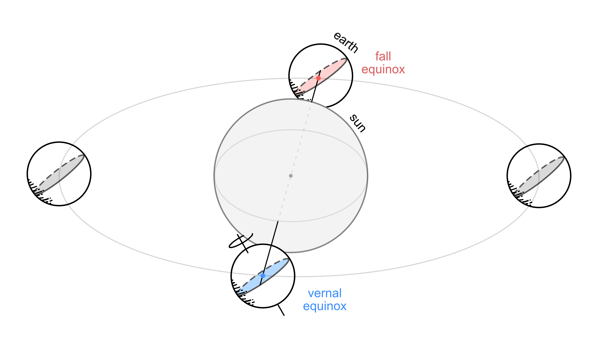
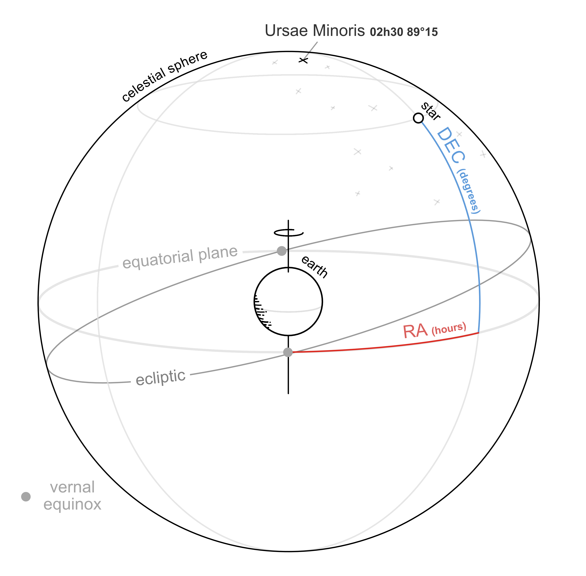
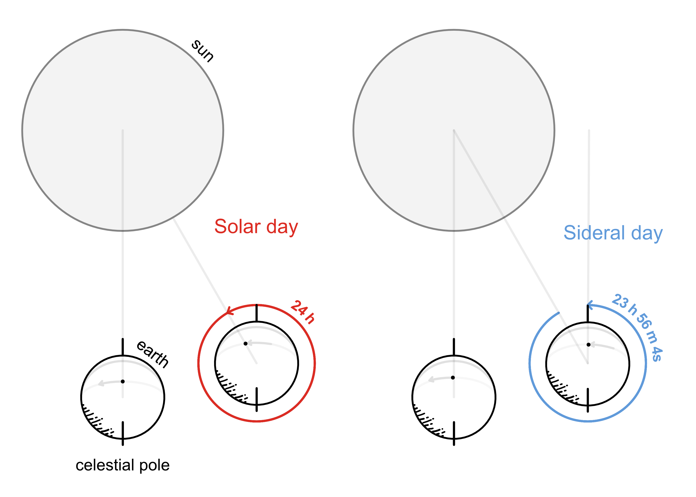

# Observational Astrophysics

    

Curated open-source illustrations used in the class of Observational Astrophysics at the University of Liège (Professor Emmanuel Jehin)

Software: [Affinity designer](https://affinity.serif.com/en-gb/)

## Illustrations

    

    

    

    

    and more ...

